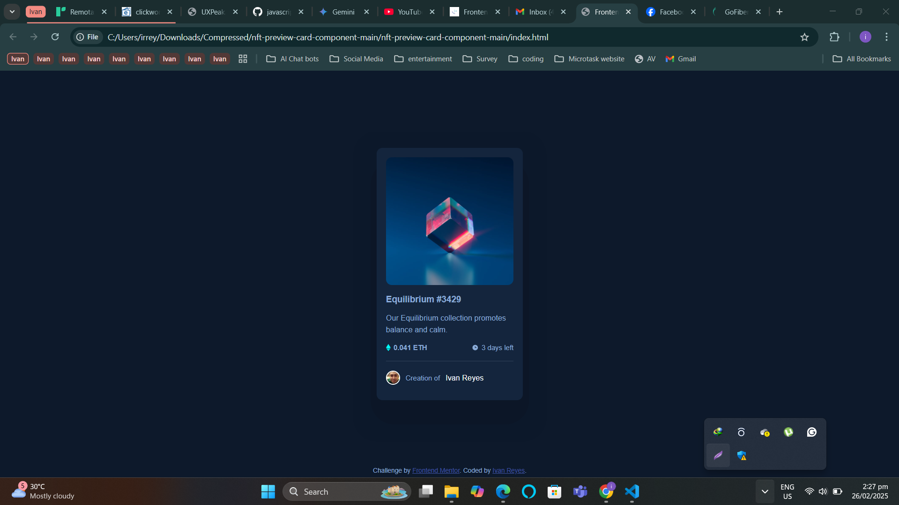

# Frontend Mentor - NFT preview card component solution

This is a solution to the [NFT preview card component challenge on Frontend Mentor](https://www.frontendmentor.io/challenges/nft-preview-card-component-SbdUL_w0U). Frontend Mentor challenges help you improve your coding skills by building realistic projects. 

## Table of contents

- [Overview](#overview)
  - [The challenge](#the-challenge)
  - [Screenshot](#screenshot)
  - [Links](#links)
- [My process](#my-process)
  - [Built with](#built-with)
  - [What I learned](#what-i-learned)
  - [Continued development](#continued-development)
  - [Useful resources](#useful-resources)
- [Author](#author)
- [Acknowledgments](#acknowledgments)

## Overview

### The challenge

Users should be able to:

- View the optimal layout depending on their device's screen size
- See hover states for interactive elements

### Screenshot

### Links

- Solution URL: [Add solution URL here](https://github.com/van3030/NFT-preview-card)
- Live Site URL: [Add live site URL here](https://van3030.github.io/NFT-preview-card/)

## My process

### Built with

- Semantic HTML5 markup
- CSS custom properties
- Flexbox
- Pseudo Element

### What I learned

I leaned how to use Pseudo Element.

### Continued development

I think I still need to deepen my understanding or skill of how to use Pseudo Elements.

### Useful resources

Youtube Tutorials

## Author

- Frontend Mentor - [@yourusername](https://github.com/van3030)

## Acknowledgments

Thanks to Kevin Powell for his yt tutorials about Pseudo Elements.
